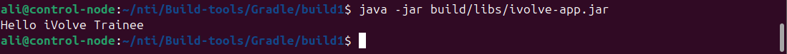

# Java Build Automation Projects

This repository demonstrates building and packaging Java applications using **Gradle** and **Maven**. 
Both tools automate compiling, testing, and packaging Java code into runnable JAR files.

---

## Part 1: Building and Packaging Java Applications with Gradle

### Prerequisites

- Java JDK 8 or higher
- Gradle 7+ (recommended)
- Git

### Installation

#### 1. Install Java
```bash
sudo apt update
sudo apt install openjdk-8-jdk -y
java -version
```

#### 2. Install Gradle
```bash
curl -s "https://get.sdkman.io" | bash
source "$HOME/.sdkman/bin/sdkman-init.sh"
sdk install gradle
gradle -v
```

### Clone the Project
```bash
git clone https://github.com/Ibrahim-Adel15/build1.git
cd build1
```

### Run Unit Tests
```bash
gradle test
```
Reports: `build/reports/tests/test/index.html`

### Build the App
```bash
gradle clean build
```
Artifact generated: `build/libs/ivolve-app.jar`

### Run the App
```bash
java -jar build/libs/ivolve-app.jar
```

### Output Screenshot (Gradle App)
Replace this with your actual screenshot once the app runs:



Capture screenshot:
```bash
gnome-screenshot -f gradle-output.png
```

---

## Part 2: Building and Packaging Java Applications with Maven

### Prerequisites

- Java JDK 8 or higher
- Maven 3.8+
- Git

### Installation

#### 1. Install Maven
```bash
sudo apt update
sudo apt install maven -y
mvn -v
```

### Clone the Project
```bash
git clone https://github.com/Ibrahim-Adel15/build2.git
cd build2
```

### Run Unit Tests
```bash
mvn test
```
Reports are generated in: `target/surefire-reports/`

### Build the App
```bash
mvn package
```
Artifact generated: `target/hello-ivolve-1.0-SNAPSHOT.jar`

### Run the App
```bash
java -jar target/hello-ivolve-1.0-SNAPSHOT.jar
```

### Output Screenshot (Maven App)
Replace this with your actual screenshot once the app runs:


Capture screenshot:
```bash
gnome-screenshot -f maven-output.png
```

---

## Project Structures

### Gradle Project (`build1/`)
```
build1/
├── src/
│   ├── main/java/        # Main source code
│   └── test/java/        # Unit tests
├── build.gradle
├── settings.gradle
├── gradle-output.png
└── README.md
```

### Maven Project (`build2/`)
```
build2/
├── src/
│   ├── main/java/        # Main source code
│   └── test/java/        # Unit tests
├── pom.xml
├── target/
├── maven-output.png
└── README.md
```

---

## Notes

### Gradle Tips
If you see errors like `sourceCompatibility` or `mainClassName`, update your `build.gradle` like this:
```gradle
java {
    sourceCompatibility = JavaVersion.VERSION_1_8
    targetCompatibility = JavaVersion.VERSION_1_8
}

application {
    mainClass = 'com.ivolve.Main'
}
```

### Maven Tips
If Maven fails to build, check that:
- You have the correct JDK version.
- `pom.xml` defines a valid `<mainClass>` under the `maven-jar-plugin` if needed.

---


