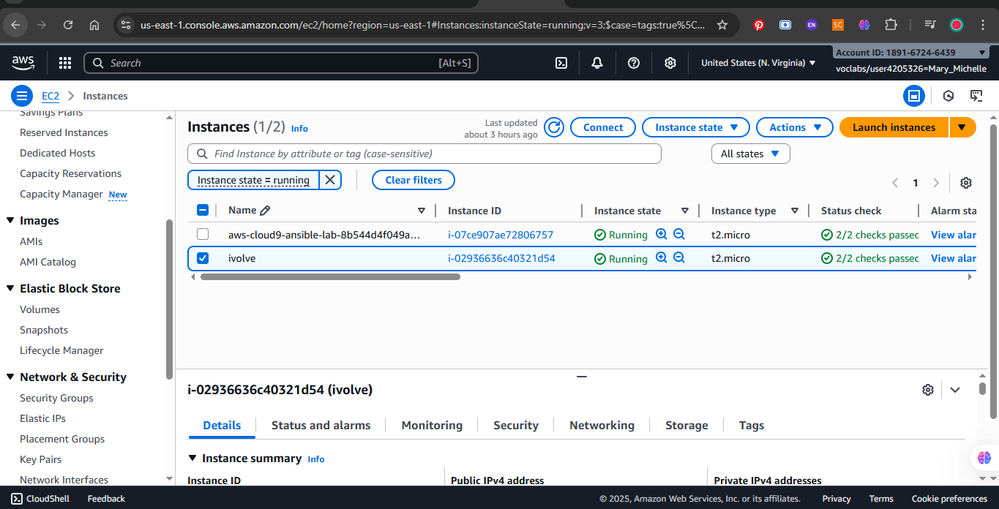
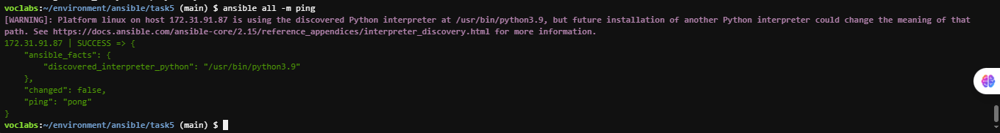
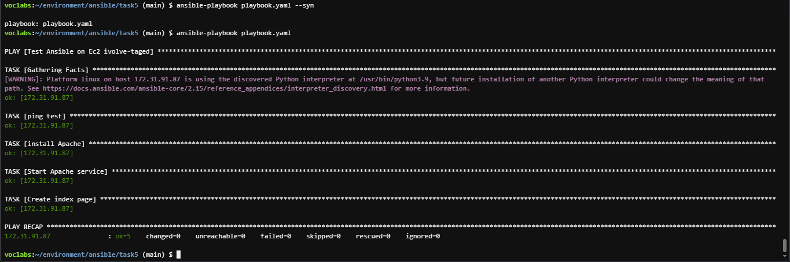

# Automated Host Discovery with Ansible Dynamic Inventory (AWS)

## Objective

Use Ansible Dynamic Inventory to automatically discover and manage EC2 instances on AWS.
Instead of manually listing hosts, Ansible dynamically retrieves running EC2 instances using the AWS EC2 inventory plugin.

---

## Environment

* Control Node: AWS Cloud9 instance (acts as Ansible controller)
* Managed Node: EC2 instance with tag **ivolve**
* Both instances are in the same VPC and subnet

---

## Steps

### 1. Create EC2 Instances

* Created two instances using AWS Console:

  * Cloud9 EC2 (control node)
  * EC2 tagged **ivolve** (managed node)
* Enabled **Auto-assign public IP**
* Ensured both are in the same VPC and subnet
* Updated security group to allow SSH (port 22) from the control node

**Screenshot – AWS Console showing EC2 instances:**


---

### 2. Configure Ansible on Cloud9

Installed and prepared Ansible and dependencies:

```bash
sudo yum install -y ansible
pip install boto3 botocore
```

Cloud9 uses an IAM role automatically, so no manual AWS key configuration was needed.

---

### 3. Dynamic Inventory File

**aws_ec2.yaml**

```yaml
plugin: aws_ec2
regions:
  - us-east-1
filters:
  tag:Name: ivolve
keyed_groups:
  - key: tags.Name
    prefix: tag
hostnames:
  - private-ip-address
compose:
  ansible_host: private_ip_address
```

Check inventory:

```bash
ansible-inventory -i aws_ec2.yaml --graph
```

Output:

```
@all:
  |--@aws_ec2:
  |  |--172.31.xx.xx
  |--@tag_ivolve:
  |  |--172.31.xx.xx
```

---

### 4. Ansible Configuration File

**ansible.cfg**

```ini
[defaults]
inventory = ./aws_ec2.yaml
remote_user = ec2-user
private_key_file = ~/.ssh/ansible-keypair.pem
host_key_checking = False

[privilege_escalation]
become = True
```

Fix SSH key permissions:

```bash
chmod 400 ~/.ssh/ansible-keypair.pem
```

---

### 5. Test Connectivity

Ping all managed nodes:

```bash
ansible all -m ping
```

Example output:

```
172.31.xx.xx | SUCCESS => {
    "changed": false,
    "ping": "pong"
}
```

**Screenshot – Ansible ping module test:**


---

### 6. Test Playbook

**test.yml**

```yaml
- name: Verify EC2 instance connectivity
  hosts: tag_ivolve
  tasks:
    - name: Print message from managed node
      debug:
        msg: "Connection successful to {{ inventory_hostname }}"
```

Run:

```bash
ansible-playbook test.yml
```

**Screenshot – Running playbook output:**


---

### 7. Access Managed EC2 Instance

After the playbook ran successfully, verified that the managed EC2 instance was reachable using its public IP.

**Command used:**

```bash
ssh -i ~/.ssh/ansible-keypair.pem ec2-user@<public_ip>
```

**Screenshot – Accessing Managed EC2 via Public IP:**


---

## Why Use Cloud9 Instead of a Local Control Node

* Cloud9 already has AWS credentials through an IAM role.
* No need to expose EC2 instances to the internet.
* No SSH or key management issues.
* Easier networking since both nodes are in the same VPC.

A local control node would require:

* Manual credential setup
* Public IPs and firewall changes
* Manual key transfers

---

## Problems and Solutions

| Problem                        | Cause                | Solution                                    |
| ------------------------------ | -------------------- | ------------------------------------------- |
| boto3/botocore not found       | Missing dependencies | Installed with pip                          |
| Unprotected private key file   | Wrong permissions    | chmod 400 key file                          |
| SSH timeout                    | Different VPC or SG  | Recreated EC2 in same subnet and updated SG |
| Permission denied              | Missing key path     | Fixed ansible.cfg key path                  |
| IAM restriction in AWS Academy | Limited IAM control  | Used Cloud9’s managed IAM role              |

---

## When to Use This Approach

* Managing multiple EC2 instances by tags or filters
* Automatically discovering hosts instead of static IPs
* Working within AWS educational environments
* Building a temporary cloud-based Ansible control node

---

## Result

* Dynamic discovery of EC2 instances by tag
* Successful Ansible ping and playbook execution
* Fully automated setup for AWS instance management
* Verified connection to managed EC2 instance via its public IP

**Screenshot – Final result and verification:**


