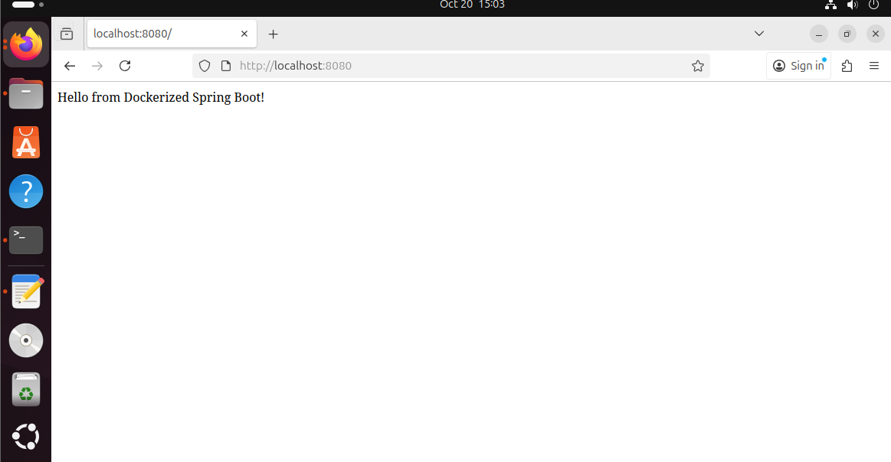

# Run Java Spring Boot App in a Docker Container

This guide explains how to containerize and run a simple **Java Spring Boot** application using **Maven** and **SAPMachine JDK 17**.

---

## Task Overview

**Objective:** Run a Java Spring Boot app inside a Docker container.

**Steps:**
1. Clone the source code.
2. Write a Dockerfile using Maven + Java 17 (SAPMachine).
3. Build the app using `mvn package`.
4. Run the `.jar` file in the container.
5. Expose port `8080`.
6. Build the image and run the container.
7. Test and verify the application.
8. Stop and remove the container.

---

## Clone the Application Code

```bash
git clone https://github.com/Ibrahim-Adel15/Docker-1.git
cd Docker-1
```

---

## Create Dockerfile

Create a file named `Dockerfile` inside the project root with the following content:

```Dockerfile
FROM maven:3.9.4-sapmachine-17
WORKDIR /app
COPY . .
RUN mvn package
CMD ["java","-jar","target/demo-0.0.1-SNAPSHOT.jar"]
EXPOSE 8080
```

###  Explanation

| Instruction | Description |
|--------------|--------------|
| `FROM` | Uses Maven with SAPMachine Java 17 as the base image |
| `WORKDIR /app` | Sets working directory inside the container |
| `COPY . .` | Copies project files into the container |
| `RUN mvn package` | Builds the Spring Boot JAR file |
| `CMD` | Runs the built JAR when the container starts |
| `EXPOSE` | Exposes port 8080 for web traffic |

---

## Build the Docker Image

```bash
docker build -t app1 .
```
 **Example Output:**
```
[INFO] BUILD SUCCESS
Successfully built abc12345
Successfully tagged app1:latest
```

Check build time and image size:
```bash
docker images app1
```

---

## Run the Container

```bash
docker run -d -p 8080:8080 --name app1_container app1
```

Check logs:
```bash
docker logs app1_container
```

---

## Test the Application

Open your browser or run:
```bash
curl http://localhost:8080
```

Expected output (example):
```
Hello, Spring Boot!
```

---

## Stop and Remove the Container

```bash
docker stop app1_container
docker rm app1_container
```

Optional cleanup:
```bash
docker rmi app1
```

---

## Extra Tips

- To **enter the running container**:
  ```bash
  docker exec -it app1_container bash
  ```

- To **view exposed ports**:
  ```bash
  docker ps
  ```

- To **check Docker permissions** (if “permission denied” occurs):
  ```bash
  sudo usermod -aG docker $USER
  newgrp docker
  docker ps
  ```

---

## Screenshot Placeholder

- **Running Application** 

---
