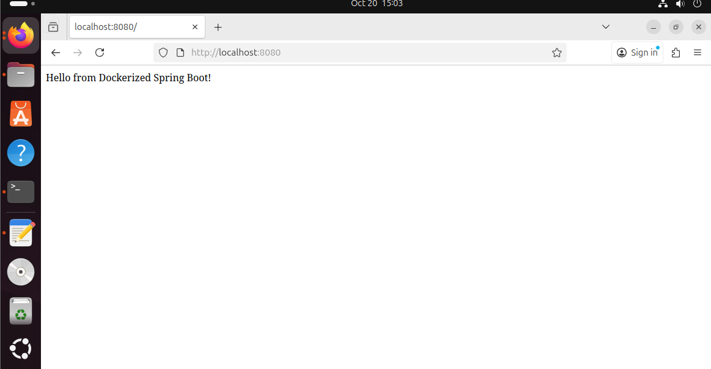

# Run Java Spring Boot App in a Container

## Task Description

Run a Java Spring Boot application in a Docker container using a pre-built JAR file and the `sapmachine:17-jdk` image.

---

## Steps

### 1. Clone the Application Code

```bash
git clone https://github.com/Ibrahim-Adel15/Docker-1.git
cd Docker-1
```

---

### 2. Build the JAR File

```bash
mvn clean package
```

✅ The generated file will be located at:

```
target/demo-0.0.1-SNAPSHOT.jar
```

---

### 3. Write Dockerfile

```dockerfile
FROM sapmachine:17-jdk
WORKDIR /app
COPY target/demo-0.0.1-SNAPSHOT.jar app.jar
CMD ["java","-jar","app.jar"]
EXPOSE 8080

```

---

### 4. Build Docker Image

```bash
docker build -t app2_image .
```

Check image size:

```bash
docker images app2_image
```

---

### 5. Run the Container

```bash
docker run -d -p 8080:8080 --name app2_container app2_image
```

---

### 6. Test the Application

```bash
curl http://localhost:8080
```

Or open in your browser:
👉 `http://localhost:8080`

---

### 7. Stop and Delete the Container

```bash
docker stop app2_container
docker rm app2_container
```

---

### Screenshots
- **Running Application** 
