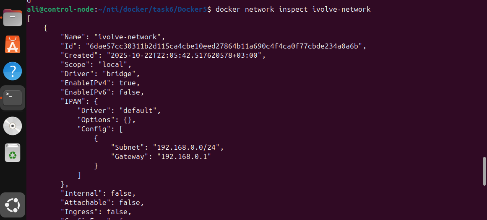
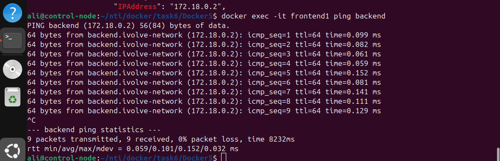
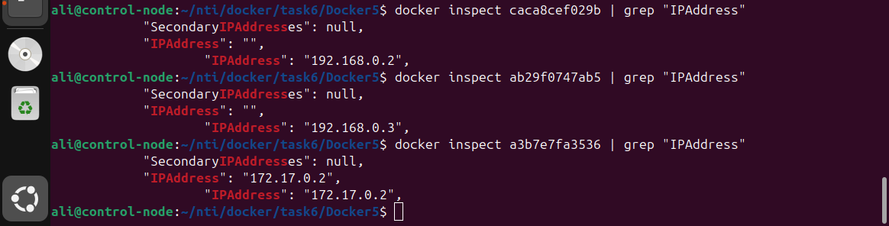

# Custom Docker Network for Microservices

## Overview

This task demonstrates how to connect multiple microservices (frontend and backend) using a custom Docker network. Both applications are simple Flask-based Python apps that communicate over a shared network.

---

## Steps

### 1. Clone the Repository

```bash
git clone https://github.com/Ibrahim-Adel15/Docker5.git
cd Docker5
```

---

### 2. Write Dockerfile for Backend

**Path:** `backend/Dockerfile`

```dockerfile
FROM python:3.10-slim
WORKDIR /app
COPY . .
RUN pip install --no-cache-dir flask
EXPOSE 5000
CMD ["python", "app.py"]
```

---

### 3. Write Dockerfile for Frontend

**Path:** `frontend/Dockerfile`

```dockerfile
FROM python:3.10-slim
WORKDIR /app
COPY . .
RUN pip install --no-cache-dir -r requirements.txt
EXPOSE 5000
CMD ["python", "app.py"]
```

---

### 4. Create Custom Network

```bash
docker network create --subnet 192.168.0.0/24 --gateway 192.168.0.1 ivolve-network
```

**Configuration used:**

* **Subnet:** 192.168.0.0/24
* **Gateway:** 192.168.0.1

---

### 5. Build Images

```bash
docker build -t backend-image ./backend
docker build -t frontend-image ./frontend
```

---

### 6. Run Containers

```bash
docker run -d --name backend --network ivolve-network backend-image
docker run -d --name frontend1 --network ivolve-network frontend-image
docker run -d --name frontend2 frontend-image
```

---

### 7. Verify Communication

* Inside `frontend1` (on ivolve-network), ping backend by name:

```bash
docker exec -it frontend1 apt update && apt install -y iputils-ping
docker exec -it frontend1 ping backend
```

* From host, test the app:

```bash
curl localhost:5000
```

---

### 8. Inspect Networks

```bash
docker network inspect ivolve-network
docker network inspect bridge
```

Observe that:

* `frontend1` and `backend` share **ivolve-network** (custom subnet).
* `frontend2` is attached to the **default bridge** network.

---

### 9. Clean Up

```bash
docker stop frontend1 frontend2 backend
docker rm frontend1 frontend2 backend
docker network rm ivolve-network
```

---

## Screenshots

* ivolve-network (Subnet & Gateway)
* Check-the-app
* Ping-from-frontend1-container
* The-different-networks-of-each-container

