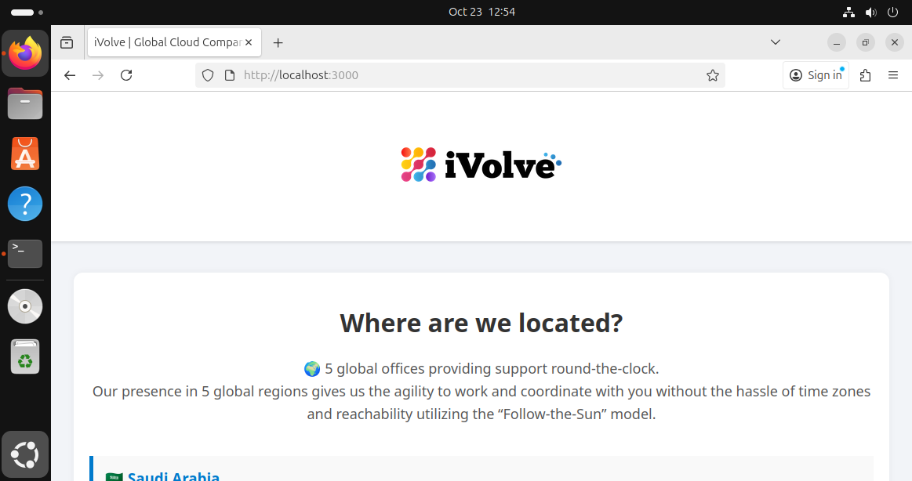

# Containerized Node.js and MySQL Stack Using Docker Compose

This project demonstrates how to containerize a full-stack **Node.js** application connected to a **MySQL** database using **Docker Compose**.
The Node.js backend communicates with a MySQL database named `ivolve` and serves a simple frontend interface.

---

## Prerequisites

Make sure the following are installed:

* [Docker](https://docs.docker.com/get-docker/)
* [Docker Compose](https://docs.docker.com/compose/)
* [Git](https://git-scm.com/)
* (Optional) [Docker Hub account](https://hub.docker.com/) — if you want to push your image

---

## Project Structure

```
.
├── db.js
├── docker-compose.yaml
├── Dockerfile
├── frontend
│   ├── assets
│   │   └── ivolve-logo.png
│   └── index.html
├── package.json
└── server.js
```

**Files:**

* `db.js` – Database connection logic (MySQL client setup)
* `server.js` – Node.js application entry point
* `frontend/` – Static frontend assets and HTML file
* `Dockerfile` – Defines how the Node.js app image is built
* `docker-compose.yaml` – Defines the multi-container setup for Node.js and MySQL

---

## Docker Compose Configuration

This setup defines two services:

* **db** — MySQL 8 container
* **app** — Node.js application container (using `app-image`)

```yaml
version: "3.9"

services:
  db:
    image: mysql:8
    container_name: mysql-db-container
    environment:
      MYSQL_ROOT_PASSWORD: admin
      MYSQL_DATABASE: ivolve
      MYSQL_USER: appuser
      MYSQL_PASSWORD: admin
    ports:
      - "3306:3306"
    volumes:
      - db_data:/var/lib/mysql

  app:
    image: app-image
    container_name: node-app-container
    depends_on:
      - db
    environment:
      DB_HOST: db
      DB_USER: appuser
      DB_PASSWORD: admin
      DB_PORT: 3306
    ports:
      - "3000:3000"

volumes:
  db_data:
```

---

## Build and Run the Stack

Start all services in detached mode:

```bash
docker compose up -d
```

Check running containers:

```bash
docker ps
```

---

## Verify MySQL Database

Access the MySQL container:

```bash
docker exec -it mysql-db-container sh
mysql -u root -p
# Enter password: admin
SHOW DATABASES;
```
 You should see a database named **ivolve**.

Screenshot:
 

---

## Verify Application Startup

View application logs to confirm it has connected to MySQL successfully:

```bash
docker logs node-app-container
```

 Screenshot:
 

---

## Health and Readiness Checks

Visit the following endpoints in your browser:

* **Health Check:** [http://localhost:3000/health](http://localhost:3000/health)
* **Readiness Check:** [http://localhost:3000/ready](http://localhost:3000/ready)

Screenshots:

*  
*  

---

## Application Logs

Logs are stored inside the container at `/app/logs`.

From host:

```bash
docker logs node-app-container
```

From inside the container:

```bash
docker exec -it node-app-container sh
cd /app/logs
ls
cat <some-log-file>.log
```

 Screenshot:


---

## Push the Application Image to Docker Hub (Optional)

If you want to publish your application image:

```bash
docker tag app-image:latest <your-dockerhub-username>/app-image:latest
docker login
docker push <your-dockerhub-username>/app-image:latest
```

 Verify it on your Docker Hub repository page.

---

## Cleanup

Stop and remove containers, networks, and volumes:

```bash
docker compose down -v
```

---

## Verification Summary

| Check          | Command / URL                    | Expected Result             |
| -------------- | -------------------------------- | --------------------------- |
| **Database**   | `SHOW DATABASES;`                | `ivolve` database exists    |
| **Health**     | `localhost:3000/health`          | Returns `200 OK`            |
| **Readiness**  | `localhost:3000/ready`           | Returns `200 OK`            |
| **Logs**       | `docker logs node-app-container` | Shows app access logs       |
| **Docker Hub** | `docker push`                    | Image uploaded successfully |

---


