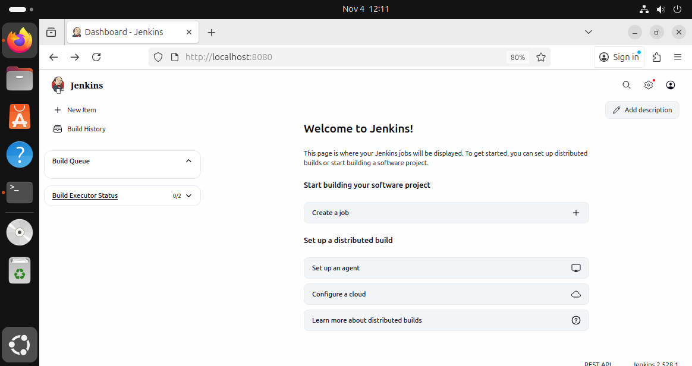

# Jenkins Installation on Ubuntu

This guide provides a clean and reliable method to install Jenkins on Ubuntu and configure it to run as a systemd service.

---

## 1. Prerequisites

- Ubuntu 20.04, 22.04, or newer  
- Sudo privileges  
- Internet connection  
- Java 17 or higher (Jenkins requires Java 11+)

Update the system and install Java:

```bash
sudo apt update
sudo apt install -y fontconfig openjdk-17-jre
java -version
```

---

## 2. Add the Jenkins Repository

Add the GPG key:

```bash
curl -fsSL https://pkg.jenkins.io/debian-stable/jenkins.io-2023.key | sudo tee   /usr/share/keyrings/jenkins-keyring.asc > /dev/null
```

Add the repository:

```bash
echo deb [signed-by=/usr/share/keyrings/jenkins-keyring.asc]   https://pkg.jenkins.io/debian-stable binary/ | sudo tee   /etc/apt/sources.list.d/jenkins.list > /dev/null
```

Update your package list:

```bash
sudo apt update
```

---

## 3. Install Jenkins

Install Jenkins from the repository:

```bash
sudo apt install -y jenkins
```

---

## 4. Enable and Start Jenkins

Enable Jenkins to start at boot and start the service:

```bash
sudo systemctl enable jenkins
sudo systemctl start jenkins
```

Check that Jenkins is running:

```bash
sudo systemctl status jenkins
```

Expected output:

```
â—ڈ jenkins.service - Jenkins Continuous Integration Server
     Loaded: loaded (/lib/systemd/system/jenkins.service; enabled)
     Active: active (running)
```

---

## 5. Access Jenkins

Once Jenkins is running, open it in your browser:

```
http://<your_server_ip>:8080
```

For local installations:

```
http://localhost:8080
```

---

## 6. Unlock Jenkins

Retrieve the initial admin password:

```bash
sudo cat /var/lib/jenkins/secrets/initialAdminPassword
```

Copy the password and paste it into the Jenkins web setup page.  
Follow the setup wizard to:

1. Install suggested plugins  
2. Create your first admin user  
3. Configure your Jenkins URL  

---

## 7. Verify Installation

Confirm Jenkins starts automatically on boot:

```bash
sudo systemctl is-enabled jenkins
```

Check if it is listening on port 8080:

```bash
sudo ss -tulnp | grep 8080
```

---

## 8. Jenkins Dashboard

After completing the setup, you should see the Jenkins Dashboard.  
 
Then reference it here:


---

