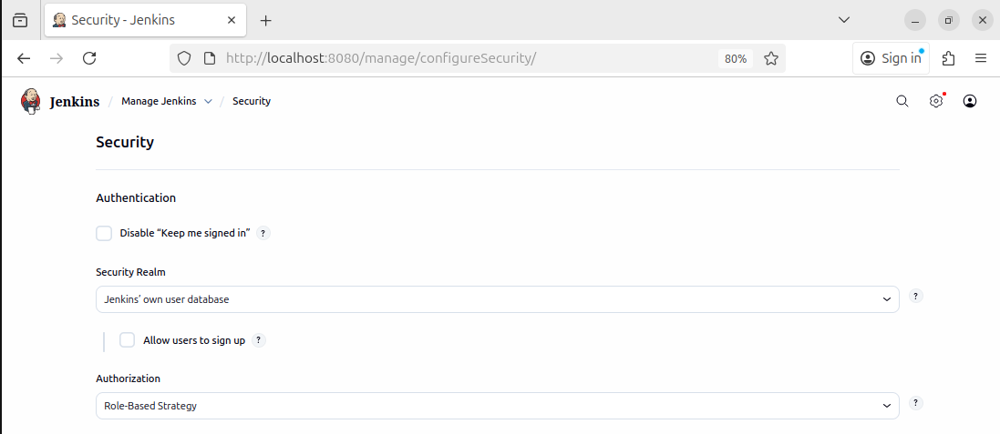
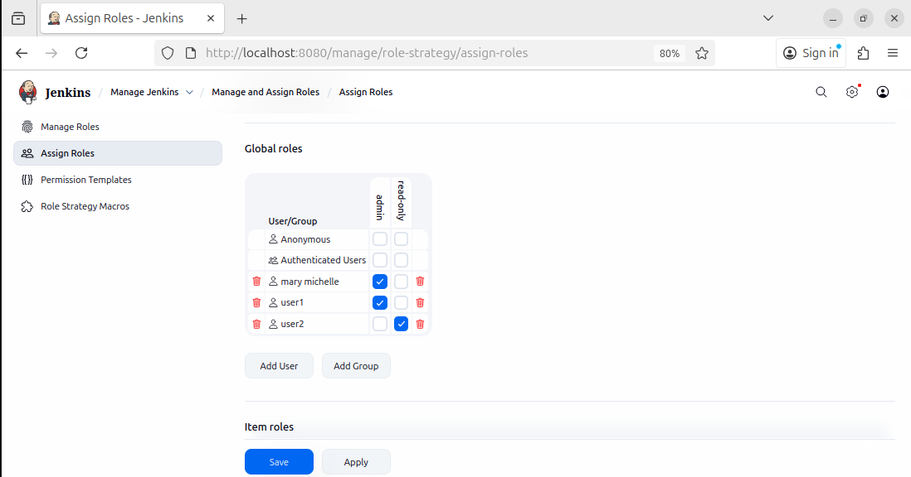

# Jenkins Role-Based Authorization Setup

This guide explains how to enable role-based access control (RBAC) in Jenkins using the **Role-Based Authorization Strategy** plugin, create two users, and assign them different roles.

---

## 1. Prerequisites

- A working Jenkins installation  
- Administrative access  
- Jenkins version 2.3+ recommended  

---

## 2. Install the Role-Based Authorization Plugin

1. Go to **Manage Jenkins → Plugins → Available Plugins**  
2. Search for **Role-Based Authorization Strategy**  
3. Select it and click **Install without restart**  

After installation, verify that the plugin is listed under the **Installed plugins** tab.



---

## 3. Enable Role-Based Authorization

1. Navigate to **Manage Jenkins → Security → Configure Global Security**  
2. Under **Authorization**, choose:

   ```
   Role-Based Strategy
   ```

3. Save the configuration.

---

## 4. Create Users

Create two users via the Jenkins UI:

1. Go to **Manage Jenkins → Users → Create User**  
2. Create:
   - `user1` (admin role)
   - `user2` (read-only role)

Alternatively, you can use the Jenkins Script Console:

```groovy
import jenkins.model.*
import hudson.security.*

def instance = Jenkins.getInstance()
def hudsonRealm = new HudsonPrivateSecurityRealm(false)

hudsonRealm.createAccount("user1", "password1")
hudsonRealm.createAccount("user2", "password2")

instance.setSecurityRealm(hudsonRealm)
instance.save()
```

---

## 5. Define Roles

1. Go to **Manage Jenkins → Manage and Assign Roles → Manage Roles**
2. Under **Global Roles**, add two new roles:
   - `admin`
   - `readonly`
3. Assign permissions:
   - **admin:** select **All permissions**
   - **readonly:** select only **Overall → Read** and any other minimal view permissions
4. Save changes.

---

## 6. Assign Roles to Users

1. Go to **Manage Jenkins → Manage and Assign Roles → Assign Roles**  
2. Under **Global Roles**:
   - Assign `user1` → `admin`
   - Assign `user2` → `readonly`  
3. Click **Save**

Example screen:



---

## 7. Test Access

- Log out and log in as **user1** → should have full admin permissions  
- Log out and log in as **user2** → should have read-only access  

You can log out anytime using:
```
http://<your_jenkins_ip>:8080/logout
```

---

## 8. Verification (Optional)

From the Jenkins Script Console, you can list all roles and assignments:

```groovy
import com.michelin.cio.hudson.plugins.rolestrategy.*

def rbac = Jenkins.instance.getAuthorizationStrategy()
println rbac.getGrantedRoles(RoleBasedAuthorizationStrategy.GLOBAL)
```

---

## Summary

| User  | Role     | Permissions  |
|--------|-----------|--------------|
| user1  | admin     | Full access  |
| user2  | readonly  | Read-only    |

---


