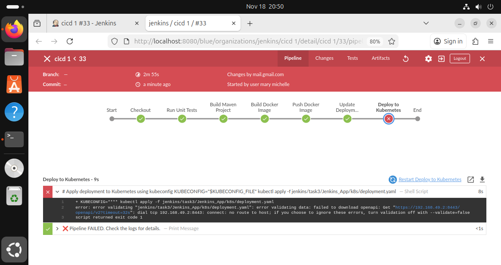

# Jenkins CI/CD Pipeline for Spring Boot Application

This repository contains a **Jenkins CI/CD pipeline** for building, testing, and deploying a Spring Boot application using **Docker** and **Kubernetes**.

## Project Structure

```
.
├── Dockerfile
├── jenkins
│   ├── jenkins-sa-kubeconfig.yaml
│   ├── kubeconfig
│   ├── RBAC.yaml
│   └── serviceaccount.yaml
├── Jenkinsfile
├── k8s
│   └── deployment.yaml
├── pom.xml
└── src
    └── main
        └── java
            └── com
                └── example
                    └── demo
                        └── DemoApplication.java
```

* **Dockerfile** – Builds the Spring Boot application into a Docker image.
* **Jenkinsfile** – Defines the CI/CD pipeline stages.
* **k8s/deployment.yaml** – Kubernetes deployment manifest.
* **jenkins/** – Contains credentials and service account files.

---

## CI/CD Pipeline Overview

The Jenkins pipeline consists of the following stages:

1. **Checkout** – Pulls the code from GitHub.
2. **Unit Tests** – Runs `mvn clean test` to verify the application.
3. **Build Maven Project** – Packages the Spring Boot application into a JAR file (`mvn clean package -DskipTests`).
4. **Build Docker Image** – Builds a Docker image with a tag in the format `build-<BUILD_NUMBER>`.
5. **Push Docker Image** – Pushes the Docker image to Docker Hub using the `docker-credential` credentials.
6. **Update Deployment YAML** – Updates `deployment.yaml` with the newly built image tag.
7. **Deploy to Kubernetes** – Applies the deployment to the Kubernetes cluster using the `jenkins-sa-credential` kubeconfig file.

---

## Environment & Credentials

* **Docker Hub Credentials**: `docker-credential` (username/password stored in Jenkins).
* **Kubernetes Credentials**: `jenkins-sa-credential` (file credential containing kubeconfig).
* **Image Tagging**: Each build creates a new image tag `build-<BUILD_NUMBER>`.

---

## Important Notes

* The Kubernetes cluster is **running on Minikube**.
* The cluster is **private** and not accessible from the Jenkins server running on a different host.
* Because of this, the **Deploy to Kubernetes stage will fail** in this setup.
* You can still **run the pipeline up to Docker build and push**, and the deployment YAML file will be updated with the new image tag.

---

## How to Use

1. Make sure **Jenkins** is installed and running.
2. Ensure **Docker** is installed and Jenkins has permission to run Docker commands.
3. Configure Jenkins credentials:

   * `docker-credential` for Docker Hub.
   * `jenkins-sa-credential` for Kubernetes kubeconfig.
4. Run the pipeline.
5. Check the **Jenkins console logs** to verify:

   * Unit tests passed.
   * Docker image was built and pushed.
   * `deployment.yaml` was updated with the new image tag.

---

## Example Deployment YAML Update

Before pipeline:

```yaml
image: maaryii/test-image:latest
```

After pipeline:

```yaml
image: maaryii/test-image:build-23
```

> Build number will change with each Jenkins build.

---
