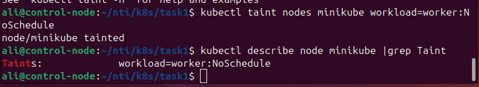

# Node Isolation Using Taints in Kubernetes

This repository demonstrates node isolation in Kubernetes using **taints and tolerations**. A pod is scheduled only on a node that has a specific taint.

## Environment

* Kubernetes cluster with 2 nodes (tested with Minikube)
* `kubectl` installed and configured
* Docker installed for local Minikube cluster

## Steps Performed

### 1. Start Minikube Cluster

```bash
minikube start --nodes=2
```

### 2. Taint the Second Node

Taint the second node with a key-value pair `workload=worker` and effect `NoSchedule`:

```bash
kubectl taint nodes minikube workload=worker:NoSchedule
```

### 3. Verify the Taint

Check that the taint is applied:

```bash
kubectl describe node minikube | grep Taints -A 1
```

Expected output:

```
Taints: workload=worker:NoSchedule
```
 Screenshot:
 


### 4. Create a Pod That Tolerates the Taint

Pod manifest (`pod.yaml`):

```yaml
apiVersion: v1
kind: Pod
metadata:
  name: nginx
spec:
  containers:
  - name: nginx
    image: nginx
  tolerations:
  - key: "workload"
    operator: "Equal"
    value: "worker"
    effect: "NoSchedule"
```

Apply the pod:

```bash
kubectl apply -f pod.yaml
```

### 5. Verify Pod Scheduling

Check that the pod is scheduled on the tainted node:

```bash
kubectl get pods -o wide
```

The pod should appear on the node with the `workload=worker:NoSchedule` taint.

### 6. Remove Taint (Optional)

To remove the taint and allow any pod to schedule on the node:

```bash
kubectl taint nodes minikube workload:NoSchedule-
```

## Summary

* Node taints prevent pods from being scheduled unless the pod has a matching toleration.
* This setup ensures **node isolation** in Kubernetes.
* The pod `nginx` demonstrates a toleration for the tainted node.

