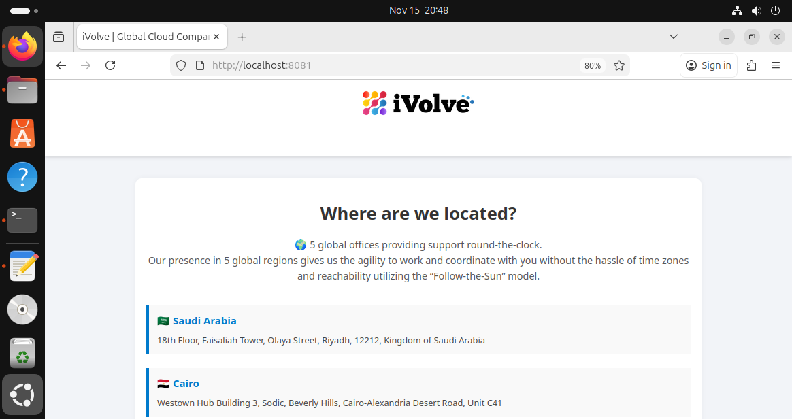
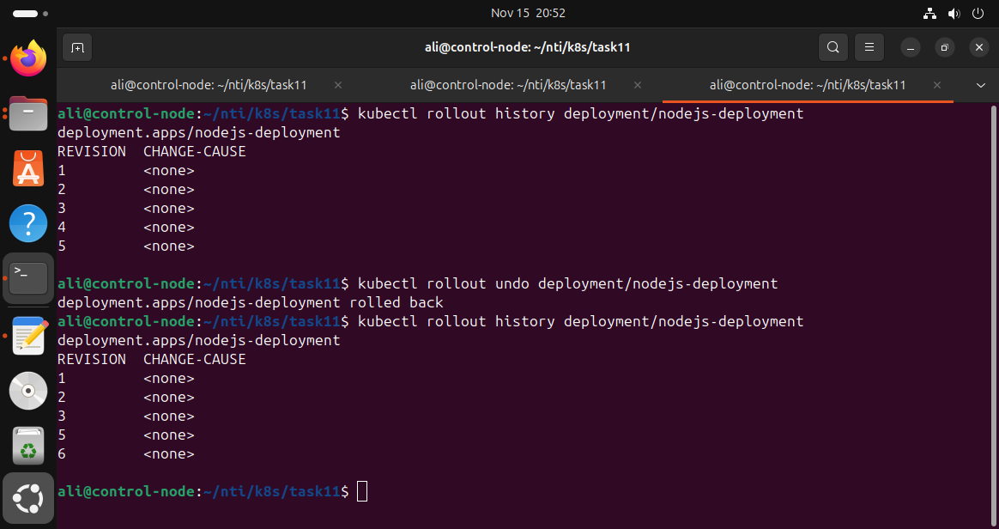
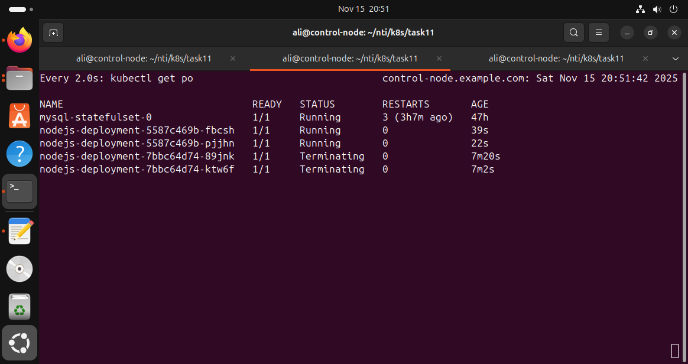
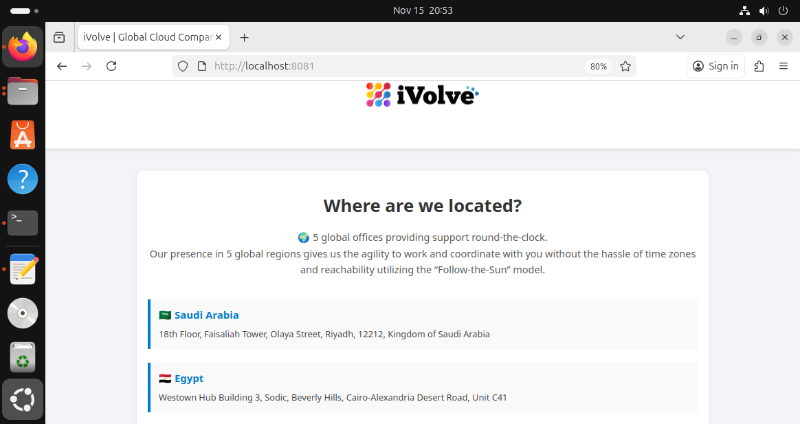

# Kubernetes Deployment Update and Rollback Guide

This guide explains how to update a Kubernetes Deployment by changing the application source code, building a new Docker image, applying the update, and performing a rollback.

---

##  Step 1 — Modify Source Code
Edit your application file:

`/frontend/index.html`

Change:
```
Egypt
```
to:
```
Cairo
```

---

##  Step 2 — Build & Push New Docker Image

```bash
docker build -t yourdockerhubusername/app:v2 .
docker push yourdockerhubusername/app:v2
```

---

##  Step 3 — Update Deployment to Use New Image

Edit your `deployment.yaml`:

```yaml
containers:
  - name: nodejs-app
    image: yourdockerhubusername/app:v2
```

Apply changes:

```bash
kubectl apply -f deployment.yaml
```

---

##  Step 4 — Monitor Rollout

```bash
kubectl rollout status deployment nodejs-deployment
```

###  Before Rolling Back


---

##  Step 5 — Verify Update

Port-forward if needed:

```bash
kubectl port-forward deploy/nodejs-deployment 8080:3000
```

Check in browser:
```
http://localhost:8080
```

You should now see **Cairo**.

---

##  Step 6 — View Deployment History

```bash
kubectl rollout history deployment nodejs-deployment
```

###  Deployment History


---

##  Step 7 — Perform Rollback

```bash
kubectl rollout undo deployment nodejs-deployment
```

Monitor the rollback:

```bash
kubectl get pods -w
```

### While Rolling Back


---

##  Step 8 — Verify Rollback

Port-forward again and verify **Egypt** is back.

### ✔ After Rolling Back


---

##  Summary
- Updated application image from `v1` → `v2`
- Observed rollout
- Verified changes
- Performed rollback to previous version
- Re-verified application

Everything is handled fully by Kubernetes Deployment rollback mechanics.

