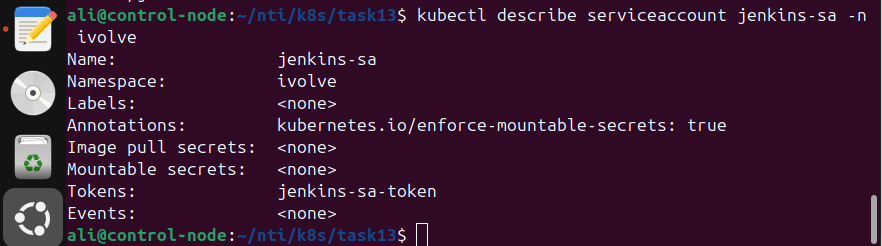

# Securing Kubernetes with RBAC and Service Accounts

This repository demonstrates how to secure access to a Kubernetes cluster using **RBAC** (Role-Based Access Control) and **Service Accounts**. The example uses a `jenkins-sa` Service Account in the `ivolve` namespace with limited permissions to read Pods.

## Objective

* Create a Service Account `jenkins-sa` in the `ivolve` namespace.
* Generate a secret to retrieve the service account token.
* Define a Role `pod-reader` granting read-only permissions (`get`, `list`) on Pods.
* Bind the Role to the Service Account using a RoleBinding.
* Bonus: Generate a kubeconfig for `jenkins-sa` to allow temporary cluster access.

## Steps Performed

### 1. Verify Service Account

```bash
kubectl get sa -n ivolve
```

Expected output:

```
NAME         SECRETS   AGE
jenkins-sa   1         10m
```

### 2. Create Role (`pod-reader`)

`role-pod-reader.yaml`:

```yaml
apiVersion: rbac.authorization.k8s.io/v1
kind: Role
metadata:
  namespace: ivolve
  name: pod-reader
rules:
- apiGroups: [""]
  resources: ["pods"]
  verbs: ["get", "list"]
```

Apply the Role:

```bash
kubectl apply -f role-pod-reader.yaml
```


### 3. Create RoleBinding

`rolebinding-jenkins-sa.yaml`:

```yaml
apiVersion: rbac.authorization.k8s.io/v1
kind: RoleBinding
metadata:
  name: jenkins-sa-pod-reader
  namespace: ivolve
subjects:
- kind: ServiceAccount
  name: jenkins-sa
  namespace: ivolve
roleRef:
  kind: Role
  name: pod-reader
  apiGroup: rbac.authorization.k8s.io
```

Apply the RoleBinding:

```bash
kubectl apply -f rolebinding-jenkins-sa.yaml
```

### 4. Retrieve Service Account Token

```bash
kubectl get secret -n ivolve
```

Identify the secret associated with `jenkins-sa` and view its token:

```bash
kubectl describe secret <jenkins-sa-secret> -n ivolve
```

### 5. (Optional) Generate kubeconfig for jenkins-sa

```bash
# Set environment variables
export SA_NAME=jenkins-sa
export NAMESPACE=ivolve
export SECRET_NAME=$(kubectl get sa $SA_NAME -n $NAMESPACE -o jsonpath="{.secrets[0].name}")

# Extract token
export SA_TOKEN=$(kubectl get secret $SECRET_NAME -n $NAMESPACE -o jsonpath="{.data.token}" | base64 --decode)

# Create kubeconfig
kubectl config set-credentials jenkins-sa --token=$SA_TOKEN
kubectl config set-context jenkins-sa-context --cluster=$(kubectl config view --minify -o jsonpath='{.clusters[0].name}') --user=jenkins-sa --namespace=ivolve
kubectl config use-context jenkins-sa-context
```

### 6. Verify Limited Access

```bash
# Can list Pods
kubectl get pods

# Cannot list Services (no permissions)
kubectl get svc
```

Expected behavior: `jenkins-sa` can read Pods but cannot access resources outside the Role.

## Summary

* Service Accounts provide a secure identity for applications or users.
* RBAC Roles and RoleBindings control fine-grained permissions.
* Custom kubeconfig allows temporary or automated access for the Service Account.

