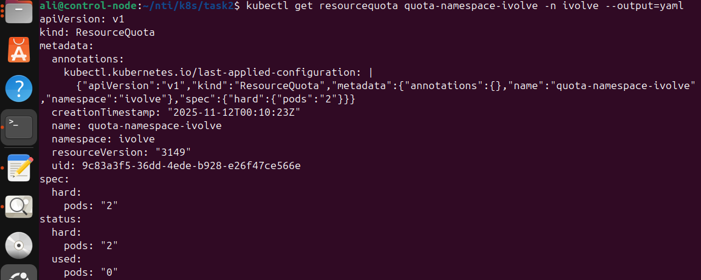

# Namespace Management and Resource Quota Enforcement

This repository demonstrates namespace management and resource quota enforcement in Kubernetes. A resource quota is applied to limit the number of pods in a specific namespace.

## Environment

* Kubernetes cluster (Minikube, Kubeadm, EKS, etc.)
* `kubectl` installed and configured

## Steps Performed

### 1. Create a Namespace

Create a namespace called `ivolve`:

```bash
kubectl create namespace ivolve
```

### 2. Create a ResourceQuota

ResourceQuota manifest (`quota.yaml`):

```yaml
apiVersion: v1
kind: ResourceQuota
metadata:
  name: quota-namespace-ivolve
  namespace: ivolve
spec:
  hard:
    pods: "2"
```

Apply the resource quota:

```bash
kubectl apply -f quota.yaml
```

### 3. Verify the ResourceQuota

Check the applied resource quota:

```bash
kubectl get resourcequota quota-namespace-ivolve -n ivolve --output=yaml
```

Expected output should show:

```
hard:
  pods: "2"
used:
  pods: "0"  # or current usage
```
 Screenshot:
 

### 4. Test Pod Creation Limit

Try creating pods in the `ivolve` namespace. After creating 2 pods, any additional pods will be **rejected** due to the resource quota:

```bash
kubectl run pod1 --image=nginx -n ivolve
kubectl run pod2 --image=nginx -n ivolve
kubectl run pod3 --image=nginx -n ivolve  # should fail
```

## Summary

* Namespace `ivolve` is created to isolate resources.
* A resource quota is applied to limit the number of pods to **2**.
* Kubernetes enforces this limit, preventing overscheduling of pods within the namespace.

