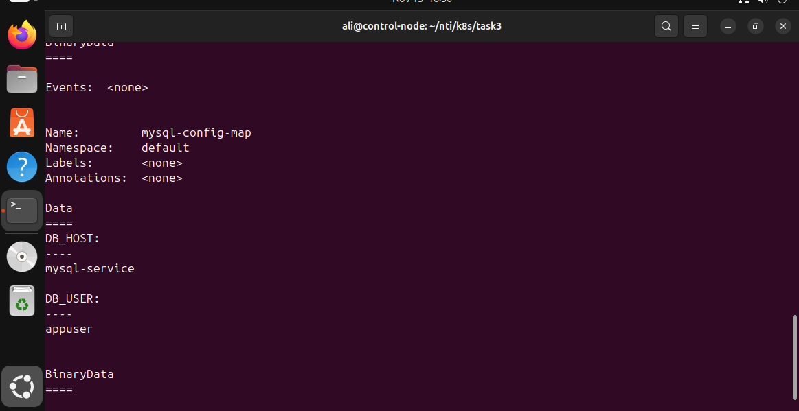
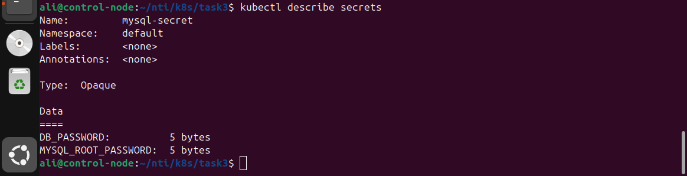

# Managing Configuration and Sensitive Data with ConfigMaps and Secrets

This repository demonstrates how to manage configuration and sensitive data in Kubernetes using **ConfigMaps** and **Secrets**.
The task was to define MySQL configuration variables and credentials that applications can use securely.

## Objective

1. Define a **ConfigMap** to store non-sensitive MySQL configuration variables:

   * `DB_HOST` – The hostname of the MySQL StatefulSet service.
   * `DB_USER` – The database user that the application will use to connect to the `ivolve` database.

2. Define a **Secret** to store sensitive MySQL credentials securely:

   * `DB_PASSWORD` – The password for the `DB_USER`.
   * `MYSQL_ROOT_PASSWORD` – The root password for the MySQL database.

## ConfigMap Manifest

```yaml
apiVersion: v1
kind: ConfigMap
metadata:
  name: mysql-config-map
data:
  DB_HOST: mysql-service
  DB_USER: appuser
```

### Apply ConfigMap

```bash
kubectl apply -f config-map.yaml
```

### Verify ConfigMap

```bash
kubectl get configmap mysql-config-map -o yaml
```

---

 Screenshot:
 

## Secret Manifest

```yaml
apiVersion: v1
kind: Secret
metadata:
  name: mysql-secret
data:
  DB_PASSWORD: YWRtaW4=
  MYSQL_ROOT_PASSWORD: YWRtaW4=
```

> Note: The values are base64 encoded.
> `YWRtaW4=` decodes to `admin`.

### Apply Secret

```bash
kubectl apply -f secret-data.yaml
```

### Verify Secret (Encoded Values)

```bash
kubectl get secret mysql-secret -o yaml
```
 Screenshot:
 

### Decode Secret to Verify Plaintext Values

```bash
kubectl get secret mysql-secret -o jsonpath="{.data.DB_PASSWORD}" | base64 --decode
kubectl get secret mysql-secret -o
```

