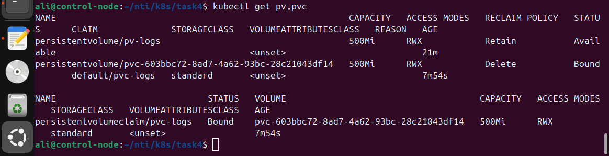

# Persistent Volume (PV) and Persistent Volume Claim (PVC) Configuration

This repository demonstrates how to configure persistent storage in Kubernetes using a **Persistent Volume (PV)** and a **Persistent Volume Claim (PVC)**.
The setup provides a shared log storage directory for pods using the **hostPath** storage type.

## Objective

1. Define a **Persistent Volume (PV)** with:

   * **Size:** 1Gi (adjusted to 500Mi due to VM storage limits)
   * **Storage Type:** `hostPath`
   * **Path:** `/mnt/app-logs`
   * **Access Mode:** `ReadWriteMany`
   * **Reclaim Policy:** `Retain`

2. Define a **Persistent Volume Claim (PVC)** that requests `500Mi` of storage.

## Pre-requisites

Before applying the YAML files, create the directory on the node and set proper permissions:

```bash
sudo mkdir -p /mnt/app-logs
sudo chmod 777 /mnt/app-logs
```

## Persistent Volume Manifest

```yaml
apiVersion: v1
kind: PersistentVolume
metadata:
  name: pv-logs
spec:
  capacity:
    storage: 500Mi
  accessModes:
    - ReadWriteMany
  persistentVolumeReclaimPolicy: Retain
  hostPath:
    path: /mnt/app-logs
```

### Apply and Verify PV

```bash
kubectl apply -f pv.yaml
kubectl get pv
kubectl describe pv pv-logs
```

## Persistent Volume Claim Manifest

```yaml
apiVersion: v1
kind: PersistentVolumeClaim
metadata:
  name: pvc-logs
spec:
  accessModes:
    - ReadWriteMany
  resources:
    requests:
      storage: 500Mi
```

### Apply and Verify PVC

```bash
kubectl apply -f pvc.yaml
kubectl get pvc
kubectl describe pvc pvc-logs
```

## Verification

Ensure that the PVC is bound to the PV:

```bash
kubectl get pv,pvc
```

Expected output example:

```
NAME             CAPACITY   ACCESS MODES   RECLAIM POLICY   STATUS   CLAIM               STORAGECLASS   AGE
pv/pv-logs       500Mi      RWX            Retain           Bound    default/pvc-logs                   1m
```
 Screenshot:
 

## Summary

* The **Persistent Volume (PV)** provides 500Mi of persistent storage on the host path `/mnt/app-logs`.
* The **Persistent Volume Claim (PVC)** requests the same capacity and binds automatically to the PV.
* The **Reclaim Policy** is set to `Retain` to preserve data even after claim deletion.
* Access mode `ReadWriteMany` allows multiple pods to read and write to the same volume simultaneously.
* The size was reduced from `1Gi` to `500Mi` to fit the VM’s available

