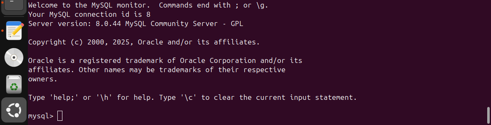

# StatefulSet Deployment with MySQL and Headless Service

This repository demonstrates how to deploy a MySQL database on Kubernetes using a **StatefulSet** and a **Headless Service**, with persistent storage and secret-managed credentials.

## Objective

* Deploy MySQL as a StatefulSet with 1 replica.
* Use a pre-existing secret for the MySQL root password.
* Add a toleration to allow the pod to run on a tainted worker node (`workload=worker:NoSchedule`).
* Use a Persistent Volume Claim (PVC) of 500Mi to store MySQL data in `/var/lib/mysql`.
* Create a Headless Service for stable pod DNS.
* Verify MySQL is operational.

## Headless Service Manifest (`mysql-service.yaml`)

```yaml
apiVersion: v1
kind: Service
metadata:
  name: mysql
spec:
  clusterIP: None
  selector:
    app: mysql
  ports:
    - port: 3306
      targetPort: 3306
```

### Apply Headless Service

```bash
kubectl apply -f mysql-service.yaml
```

## StatefulSet Manifest (`mysql-statefulset.yaml`)

```yaml
apiVersion: apps/v1
kind: StatefulSet
metadata:
  name: mysql
spec:
  serviceName: mysql
  replicas: 1
  selector:
    matchLabels:
      app: mysql
  template:
    metadata:
      labels:
        app: mysql
    spec:
      tolerations:
      - key: "workload"
        operator: "Equal"
        value: "worker"
        effect: "NoSchedule"
      containers:
      - name: mysql
        image: mysql:8.0
        ports:
        - containerPort: 3306
          name: mysql
        env:
        - name: MYSQL_ROOT_PASSWORD
          valueFrom:
            secretKeyRef:
              name: mysql-secret
              key: MYSQL_ROOT_PASSWORD
        volumeMounts:
        - name: mysql-storage
          mountPath: /var/lib/mysql
  volumeClaimTemplates:
  - metadata:
      name: mysql-storage
    spec:
      accessModes: ["ReadWriteOnce"]
      resources:
        requests:
          storage: 500Mi
```

### Apply StatefulSet

```bash
kubectl apply -f mysql-statefulset.yaml
```

## Verification Steps

1. Check pod status:

```bash
kubectl get pods
```

2. Check PVC and PV:

```bash
kubectl get pvc
kubectl get pv
```

3. Check headless service:

```bash
kubectl get svc
```

4. Connect to MySQL pod:

```bash
kubectl exec -it mysql-0 -- mysql -u root -p
```

Enter the password stored in your secret.

Expected MySQL prompt:

```
mysql>
```
 Screenshot:
 

## Summary

* The StatefulSet ensures **stable pod identity** and **persistent storage**.
* The headless service provides a **stable DNS entry** for each pod.
* The pod uses the **existing secret** for root password securely.
* The PVC ensures MySQL data persists even if the pod restarts.
* The toleration allows the pod to schedule on a tainted worker node.
* Storage size was reduced to **500Mi** to match VM limitations.

