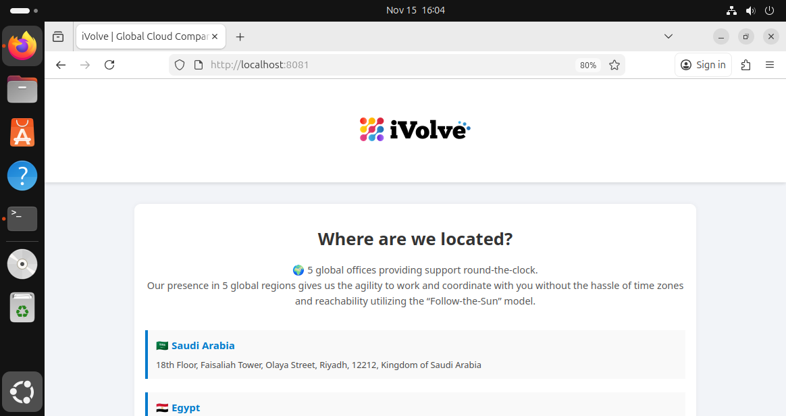

# Node.js Deployment with Init Container for MySQL Database Setup

This repository demonstrates how to use a Kubernetes **Init Container** to set up a MySQL database and user before deploying a Node.js application. The deployment uses a Persistent Volume for logs and environment variables from ConfigMap and Secret.

---

## Objective

* Modify an existing Node.js Deployment to include an init container.
* Use a MySQL client image (`mysql:5.7`) for the init container.
* Pass necessary DB connection parameters using environment variables.
* The init container creates the `ivolve` database and `appuser` with all privileges.
* Use `kubectl logs` to confirm the database and user are created successfully.
* Connect to MySQL manually to verify `ivolve` DB and `appuser`.
* Use `kubectl port-forward` to test the Node.js application.

---

## Deployment Manifest (`deployment.yaml`)

```yaml
apiVersion: apps/v1
kind: Deployment
metadata:
  name: nodejs-deployment
spec:
  replicas: 2
  selector:
    matchLabels:
      app: nodejs
  template:
    metadata:
      labels:
        app: nodejs
    spec:
      tolerations:
        - key: "workload"
          operator: "Equal"
          value: "worker"
          effect: "NoSchedule"

      initContainers:
        - name: db-init
          image: mysql:5.7
          command:
            - sh
            - -c
            - |
              echo "Waiting for MySQL to become available..."
              until mysqladmin ping -h "$DB_HOST" -u root -p"$DB_ROOT_PASSWORD" --silent; do
              echo "MySQL not ready. Retrying..."
              sleep 3
              done
              echo "MySQL is ready. Creating database and user..."
              mysql -h "$DB_HOST" -u root -p"$DB_ROOT_PASSWORD" <<EOF
              CREATE DATABASE IF NOT EXISTS ivolve;
              CREATE USER IF NOT EXISTS 'appuser'@'%' IDENTIFIED BY '$DB_PASSWORD';
              GRANT ALL PRIVILEGES ON ivolve.* TO 'appuser'@'%';
              FLUSH PRIVILEGES;
              EOF
              echo "Database and user created successfully!"
          env:
            - name: DB_HOST
              valueFrom:
                configMapKeyRef:
                  name: mysql-config-map
                  key: DB_HOST
            - name: DB_ROOT_PASSWORD
              valueFrom:
                secretKeyRef:
                  name: mysql-secret
                  key: MYSQL_ROOT_PASSWORD
            - name: DB_PASSWORD
              valueFrom:
                secretKeyRef:
                  name: mysql-secret
                  key: DB_PASSWORD

      containers:
        - name: nodejs-pod
          image: maaryii/app-image
          ports:
            - containerPort: 3000
          envFrom:
            - configMapRef:
                name: mysql-config-map
          env:
            - name: DB_PASSWORD
              valueFrom:
                secretKeyRef:
                  name: mysql-secret
                  key: DB_PASSWORD
          volumeMounts:
            - name: app-logs
              mountPath: /var/log/app

      volumes:
        - name: app-logs
          persistentVolumeClaim:
            claimName: pvc-logs
```

---

## Steps to Apply

1. Apply the Deployment:

```bash
kubectl apply -f deployment.yaml
```

2. Verify pods are running:

```bash
kubectl get pods
```

3. Check init container logs to confirm DB and user creation:

```bash
kubectl logs <pod-name> -c db-init
```

Expected output:

```
MySQL is ready. Creating database and user...
Database and user created successfully!
```

---

## Verify Database Manually

If the Node.js container does not have the MySQL client, you can use a temporary MySQL client pod:

```bash
kubectl run mysql-client --rm -it --image=mysql:5.7 -- bash
```

Then connect:

```bash
mysql -h <mysql-service-name> -u appuser -p
```

* Replace `<mysql-service-name>` with your MySQL service (e.g., `mysql`).
* Enter the password from your secret.
* Run:

```sql
SHOW DATABASES;
SELECT User, Host FROM mysql.user WHERE User='appuser';
```

---

## Test the Node.js Application

Use port-forward to access the Node.js app locally:

```bash
kubectl port-forward svc/nodejs-service 8081:3000
```
 Screenshot:


Then in a browser or with curl:

```bash
curl http://localhost:8081/health
curl http://localhost:8081/ready
```

---

## Summary

* The **init container** ensures that the `ivolve` database and `appuser` are created before the Node.js app starts.
* The Node.js container reads DB connection info from **ConfigMap** and **Secret**.
* Persistent Volume is used for application logs.
* **Port-forwarding** allows testing the app locally without exposing it externally.

