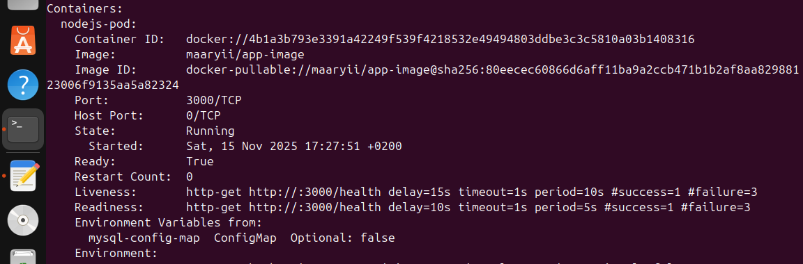

# Node.js Deployment with Init Container and Health Monitoring

This repository demonstrates a **Node.js application deployment on Kubernetes** with:

* Pre-deployment database setup using an **init container**
* Environment variables from ConfigMap and Secret
* Persistent storage using a PVC
* **Health monitoring** using readiness and liveness probes
* Tolerations to run pods on tainted worker nodes

---

## Objective

* Create a Deployment with 2 replicas of a Node.js application.
* Use a MySQL client init container to pre-create the database (`ivolve`) and user (`appuser`) before the main application starts.
* Mount a persistent volume to store application logs.
* Configure readiness and liveness probes to monitor pod health.
* Use environment variables from ConfigMap and Secret for database connection.
* Forward local port to the service for testing.

---

## Deployment Manifest (`deployment.yaml`)

```yaml
apiVersion: apps/v1
kind: Deployment
metadata:
  name: nodejs-deployment
spec:
  replicas: 2
  selector:
    matchLabels:
      app: nodejs
  template:
    metadata:
      labels:
        app: nodejs
    spec:
      tolerations:
        - key: "workload"
          operator: "Equal"
          value: "worker"
          effect: "NoSchedule"

      initContainers:
        - name: db-init
          image: mysql:5.7
          command:
            - sh
            - -c
            - |
              echo "Waiting for MySQL to become available..."
              until mysqladmin ping -h "$DB_HOST" -u root -p"$DB_ROOT_PASSWORD" --silent; do
                echo "MySQL not ready. Retrying..."
                sleep 3
              done
              echo "MySQL is ready. Creating database and user..."
              mysql -h "$DB_HOST" -u root -p"$DB_ROOT_PASSWORD" <<EOF
CREATE DATABASE IF NOT EXISTS ivolve;
CREATE USER IF NOT EXISTS 'appuser'@'%' IDENTIFIED BY '$DB_PASSWORD';
GRANT ALL PRIVILEGES ON ivolve.* TO 'appuser'@'%';
FLUSH PRIVILEGES;
EOF
              echo "Database and user created successfully!"
          env:
            - name: DB_HOST
              valueFrom:
                configMapKeyRef:
                  name: mysql-config-map
                  key: DB_HOST
            - name: DB_ROOT_PASSWORD
              valueFrom:
                secretKeyRef:
                  name: mysql-secret
                  key: MYSQL_ROOT_PASSWORD
            - name: DB_PASSWORD
              valueFrom:
                secretKeyRef:
                  name: mysql-secret
                  key: DB_PASSWORD

      containers:
        - name: nodejs-pod
          image: maaryii/app-image
          ports:
            - containerPort: 3000
          envFrom:
            - configMapRef:
                name: mysql-config-map
          env:
            - name: DB_PASSWORD
              valueFrom:
                secretKeyRef:
                  name: mysql-secret
                  key: DB_PASSWORD
          volumeMounts:
            - name: app-logs
              mountPath: /var/log/app
          readinessProbe:
            httpGet:
              path: /health
              port: 3000
            initialDelaySeconds: 10
            periodSeconds: 5
          livenessProbe:
            httpGet:
              path: /health
              port: 3000
            initialDelaySeconds: 15
            periodSeconds: 10

      volumes:
        - name: app-logs
          persistentVolumeClaim:
            claimName: pvc-logs
```

---

## Steps Performed

### 1. Apply Deployment

```bash
kubectl apply -f deployment.yaml
```

### 2. Verify Pods

```bash
kubectl get pods
kubectl describe pod <pod-name>
```

### 3. Check Init Container Logs

```bash
kubectl logs <pod-name> -c db-init
```

You should see the logs confirming the creation of the `ivolve` database and `appuser`.

### 4. Health Monitoring

* **Readiness probe** ensures the pod only receives traffic when `/health` endpoint returns success.
* **Liveness probe** restarts the pod if `/health` endpoint fails repeatedly.

Check probe status with:

```bash
kubectl describe pod <pod-name>
```

---

### 5. Port Forwarding for Testing

```bash
kubectl port-forward svc/nodejs-service 8081:3000
```

Then access your app locally at: `http://localhost:8081`

---

## Summary

* Init container pre-creates MySQL database and user.
* Main Node.js container uses environment variables from ConfigMap and Secret.
* Persistent storage is mounted for application logs.
* Readiness and liveness probes ensure proper health monitoring.
* Toleration allows pods to run on tainted worker nodes.

