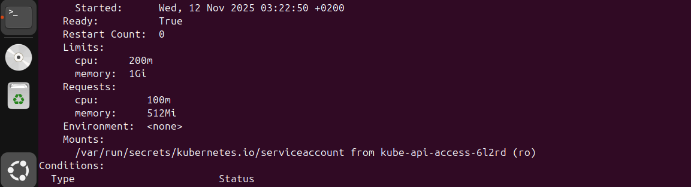
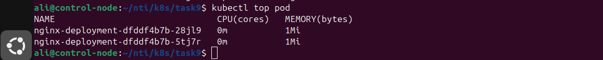

# Pod Resource Management with CPU and Memory Requests and Limits

This repository demonstrates how to manage pod resources in Kubernetes by specifying CPU and memory **requests** and **limits**. The task was to update an existing Node.js Deployment with the following resources:

* **Resource Requests:**

  * cpu: 1 (1 vCPU)
  * memory: 1Gi
* **Resource Limits:**

  * cpu: 2 (2 vCPUs)
  * memory: 2Gi

## Note

The values in the deployment have been adjusted to accommodate the resource limitations of the VM used for testing. The modified values are:

* **Resource Requests:**

  * cpu: 0.1 (100m)
  * memory: 512Mi
* **Resource Limits:**

  * cpu: 0.2 (200m)
  * memory: 1Gi

## Deployment Manifest

```yaml
apiVersion: apps/v1
kind: Deployment
metadata:
  name: nginx-deployment
  labels:
    app: nginx
spec:
  replicas: 2
  selector:
    matchLabels:
      app: nginx
  template:
    metadata:
      labels:
        app: nginx
    spec:
      containers:
      - name: nginx
        image: nginx:1.14.2
        resources:
          requests:
            memory: "512Mi"
            cpu: 0.1
          limits:
            memory: "1Gi"
            cpu: 0.2
        ports:
        - containerPort: 80
```

## Steps Performed

### 1. Apply Deployment

```bash
kubectl apply -f deployment.yaml
```

### 2. Verify Resource Requests and Limits

Use `kubectl describe pod` to check the applied resources:

```bash
kubectl describe pod <pod-name>
```

Look for the `Requests` and `Limits` sections under the container details.

 Screenshot:
 

### 3. Monitor Real-Time Usage

Use `kubectl top pod` to monitor CPU and memory usage of the pods:

```bash
kubectl top pod
```

 Screenshot:
 

> Note: Actual usage may be lower than requested values if the container is idle.

## Summary

* Resource requests guarantee scheduling resources for pods.
* Resource limits cap the maximum resources a pod can use.
* Adjustments were made to fit the VM limitations, but the principles remain the same.
* `kubectl describe pod` and `kubectl top pod` are used to verify and monitor resources.

